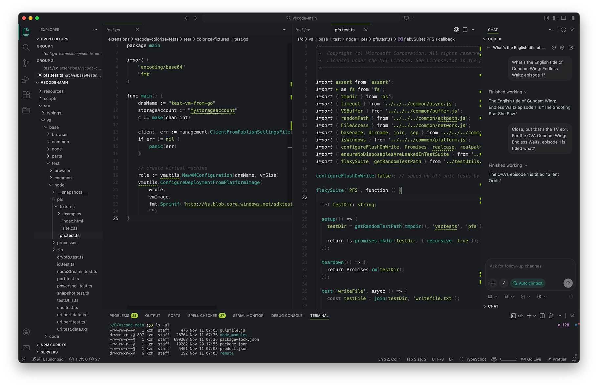

# Orbit

Orbit is a bright, structure-first dark theme. Core syntax (flow keywords, operators) uses crisp light tones so you can scan code quickly, while teal and olive accents anchor UI, diagnostics, and diff states without overwhelming the page.

## Key features

- **Structure pops**: bright operators/keywords for fast reading; comments and punctuation stay muted.
- **Cohesive UI**: teal/olive accents reused across status bar, tabs, and GitLens/testing panels.
- **Subtle surfaces**: layered dark, subtle backgrounds with soft selections; terminals use matching ANSI colors.

## Changelog

See [CHANGELOG.md](./CHANGELOG.md) for release notes.

## License

[MIT](./LICENSE)
